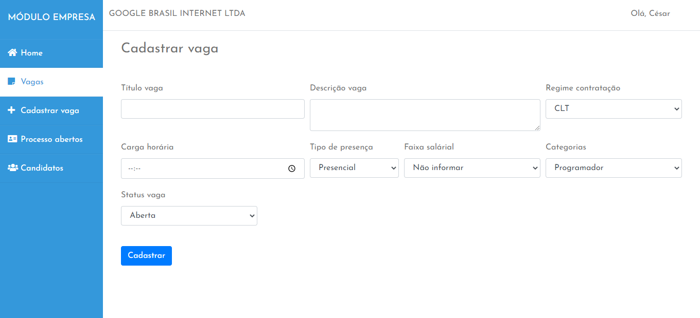
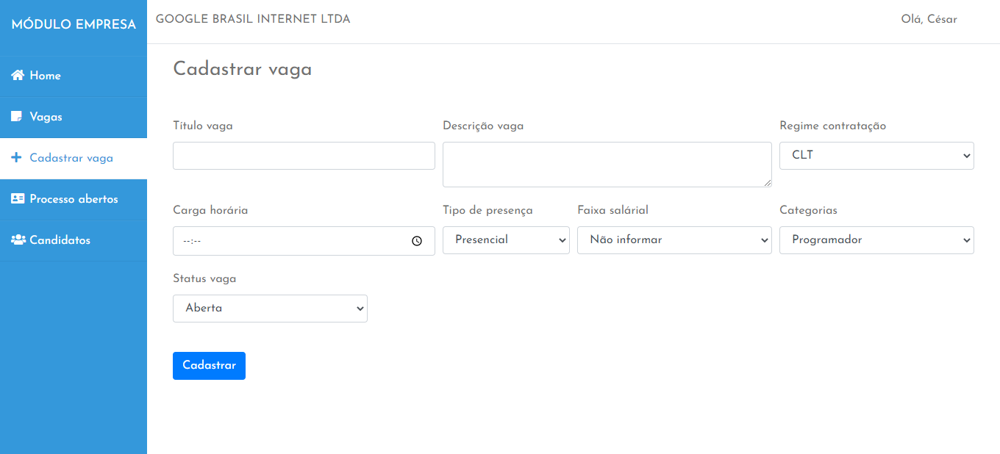

# EmpregosCodeIgniter
 
Módulo gerencial e api para o projeto <a href="https://github.com/cesar99144/AppEmpregos-ReactNative" target="_blank">App empregos</a>.

    
    

<h3>Módulo web</h3>
O site é apenas para os recrutadores das empresas, atráves do módulo eles podem postar vagas, inativar e acompanhar os processos. Os candidatos devem utilizar o <a href="https://github.com/cesar99144/AppEmpregos-ReactNative" target="_blank">Aplicativo</a>

<h3>Algumas rotas da api</h3>
<blockquote>
    <ul>
      <li><code>/candidatos/create</code> (Recebe os dados do candidato para relizar um cadastro)</li> 
      <li><code>/candidatos/login</code> (Rota para os candidatos fazerem o login)</li> 
      <li><code>/vagas/recentes</code> (Retorna o json de uma quantidade limitada de vagas, apenas para exibir na home)</li> 
      <li><code>/vagas</code> (Retorna um json com todas as vagas ativas)</li> 
      <li><code>/vagascandidaturas</code> (Retorna um json com todas as vagas que o usuário se candidatou)</li> 
    </ul>
</blockquote>